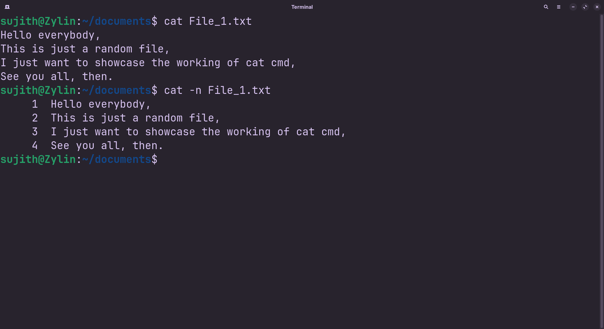

<!-- meta: day=10 cmd="cat" category="Text Processing" file="10. cat.md" date="2026-08-19" -->
  

# `cat`

> Print the contents of a file.

---

## Description

cat (Concatenate) reads data sequentially from one or more files and prints the complete content directly to your terminal. It offers a quick way to inspect short text files without launching a full graphical or text-based editor.

## Syntax

```bash
cat [OPTIONS] FILE
```

## Options

| Flag | Long Flag | Description |
|------|-----------|-------------|
| `-n` | `--number` | Show line numbers next to each line. |
| `-A` | `--show-all` | Show hidden characters like tabs and line endings. |

## Arguments

| Argument | Description |
|----------|-------------|
| `FILE` | The file (or files) whose contents you want printed. |

## Execution & Output

```text
sujith@Zylin:~$ cat README.md
# Linux Commands Cheat Sheet
```


