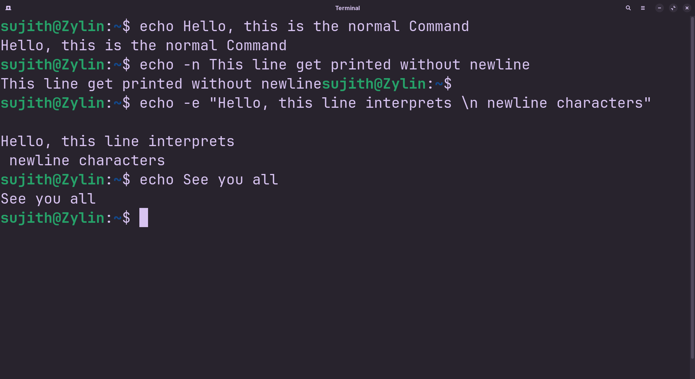

<!-- meta: day=11 cmd="echo" category="Text Processing" file="11. echo.md" date="2026-08-20" -->
  

# `echo`

> Print text to the screen.

---

## Description

echo prints given text arguments straight to the standard output stream (your terminal). It is heavily utilized in shell automation scripts to display status updates, print environment variable values, or write text directly into files.

## Syntax

```bash
echo [OPTIONS] "TEXT"
```

## Options

| Flag | Long Flag | Description |
|------|-----------|-------------|
| `-n` | `—` | Print the text without adding a new line at the end. |
| `-e` | `—` | Interpret special characters like \n (new line) inside the text. |

## Arguments

| Argument | Description |
|----------|-------------|
| `TEXT` | The text you want printed to the screen. |

## Execution & Output

```text
sujith@Zylin:~$ echo "Day 9 complete"
y 9 complete
```


