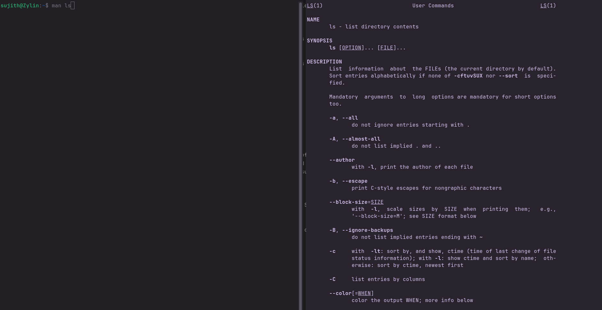

<!-- meta: day=12 cmd="man" category="System Utilities" file="12. man.md" date="2026-08-22" -->
  

# `man`

> Open the manual page for a command.

---

## Description

man (Manual) opens the system's official documentation viewer for installed command-line utilities. It provides structured references outlining a command's purpose, expected syntax formats, argument rules, and supported options.

## Syntax

```bash
man COMMAND_NAME
```

## Options

| Flag | Long Flag | Description |
|------|-----------|-------------|
| `-k` | `--apropos` | Search manual page descriptions for a keyword. |

## Arguments

| Argument | Description |
|----------|-------------|
| `COMMAND_NAME` | The command you want to read the manual for, e.g. ls or cp. |

## Execution & Output


