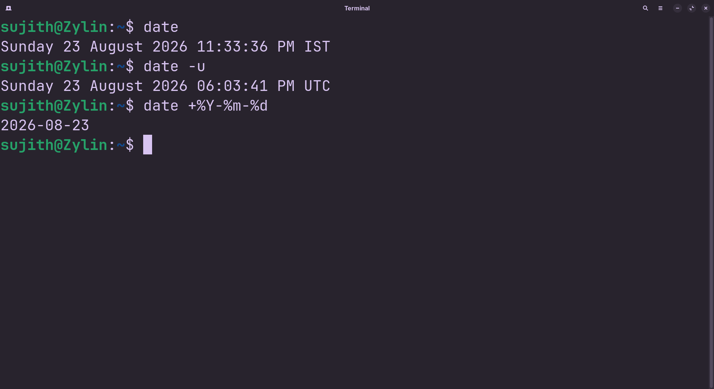

<!-- meta: day=13 cmd="date" category="System Info & Users" file="13. date.md" date="2026-08-23" -->
  

# `date`

> Show the current date and time

---

## Description

date retrieves and prints system clock details, including the current day, time, timezone, and calendar year. It also supports custom formatting strings to standardize timestamp generation for logging scripts.

## Syntax

```bash
date [+FORMAT]
```

## Options

| Flag | Long Flag | Description |
|------|-----------|-------------|
| `-u` | `--utc` | Show the date and time in UTC instead of your local timezone. |
| `-d` | `--date==STRING` | Display a date described in STRING, instead of today. |

## Arguments

| Argument | Description |
|----------|-------------|
| `+FORMAT` | An optional pattern (like +%Y-%m-%d) describing how to format the output. |

## Execution & Output

```text
sujith@Zylin:~$ date
Wed Aug 12 09:32:11 IST 2026
```


