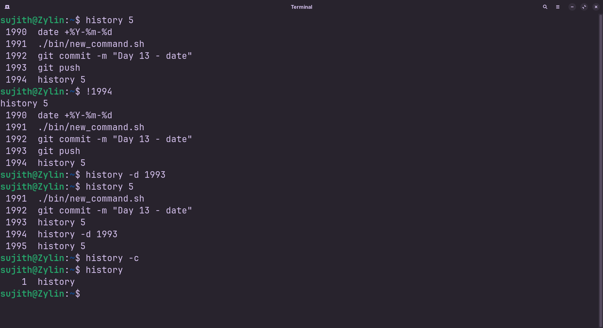

<!-- meta: day=14 cmd="history" category="Shell Productivity" file="14. history.md" date="2026-08-27" -->
  

# `history`

> List your recently used commands

---

## Description

history displays an indexed log of commands previously executed in your active shell environment. It helps you reference past commands, verify sequence steps, or quickly locate and re-run complex commands without retyping them.

## Syntax

```bash
history [OPTIONS] N
```

## Options

| Flag | Long Flag | Description |
|------|-----------|-------------|
| `-c` | `--clear` | Clear the entire command history. |
| `-d` | `OFFSET` | Delete a single history entry at position OFFSET. |

## Arguments

| Argument | Description |
|----------|-------------|
| `N` | Optional number limiting the output to your last N commands. |

## Execution & Output

```text
sujith@Zylin:~$ history 3
  101  cd cheatsheet
  102  ls
  103  cat day01
```


