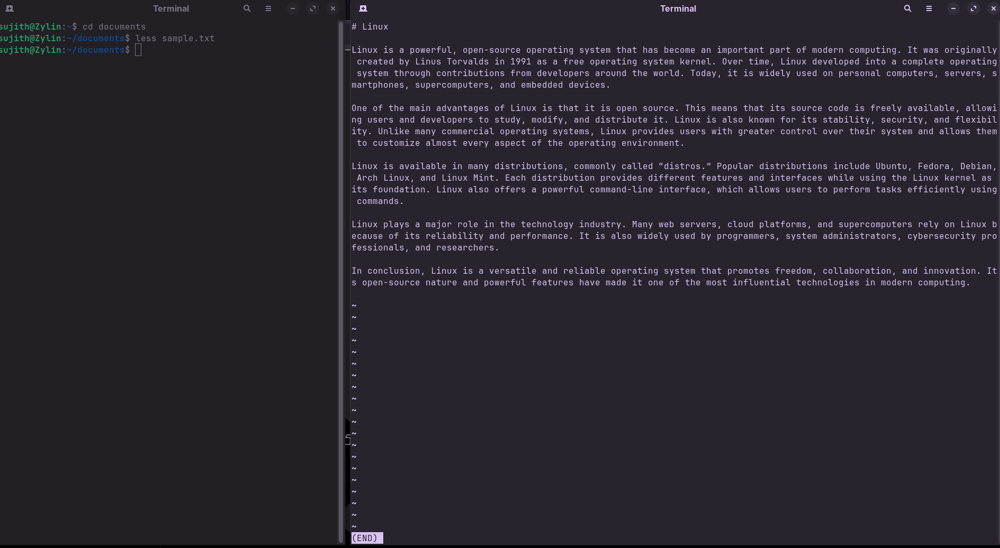

<!-- meta: day=15 cmd="less" category="Text Processing" file="15. less.md" date="2026-08-29" -->
  

# `less`

> View a file one screen at a time

---

## Description

less is a file viewer that displays text page by page. Unlike cat, which loads entire files at once, less opens content dynamically in segments, allowing smooth navigation through massive log files without consuming excess memory.

## Syntax

```bash
less [OPTIONS] FILE
```

## Options

| Flag | Long Flag | Description |
|------|-----------|-------------|
| `-N` | `—` | Show line numbers on the left. |
| `-S` | `--chop-long-lines` | Don't wrap long lines; scroll sideways instead. |

## Arguments

| Argument | Description |
|----------|-------------|
| `FILE` | The file you want to open and scroll through. Press 'q' to quit. |

## Execution & Output

```text
sujith@Zylin:~$ less README.md
# Linux Commands Cheat Sheet
(use arrow keys to scroll, 'q' to quit)
```


