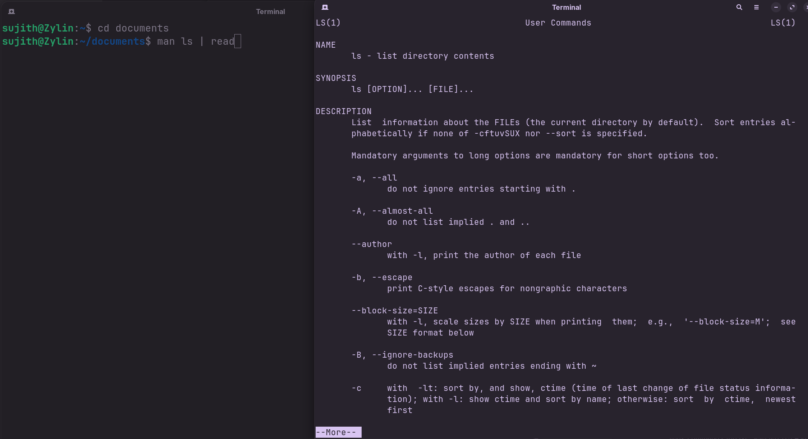

<!-- meta: day=16 cmd="more" category="Text Processing" file="16. more.md" date="2026-08-30" -->
  

# `more`

> View a file page by page

---

## Description

more is a legacy terminal pager designed to read text files screen by screen. While less offers broader backwards navigation, more provides a simple interface for stepping forward through structured text documents.

## Syntax

```bash
more [OPTIONS] FILE
```

## Options

| Flag | Long Flag | Description |
|------|-----------|-------------|
| `+N` | `—` | Start displaying from line number N. |
| `-d` | `—` | Show helpful prompts like 'Press space to continue' |

## Arguments

| Argument | Description |
|----------|-------------|
| `FILE` | The file you want to view page by page. |

## Execution & Output

```text
sujith@Zylin:~$ more README.md
# Linux Commands Cheat Sheet
--More--(
```


