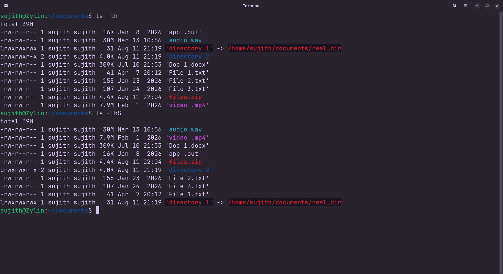

<!-- meta: day=2 cmd="ls" category="File Navigation" file="day02-ls.md" date="2026-08-11" -->
  


# `ls`

> Inspect and list directory contents and file metadata.

---

## Description

ls lists files and directories within the specified path. It exposes essential file attributes such as permissions, file sizes, ownership, and modification timestamps.

## Syntax

```bash
ls [OPTIONS] [FILE/DIR]
```

## Options

| Flag | Long Flag | Description |
|------|-----------|-------------|
| -l | --format==long | Display detailed long listing format (permissions, owner, group, size, date). |
| -a | --all | Show all entries including hidden files and directories starting with .  . |
| -A | --almost-all | Show hidden files but omit implied . (current) and .. (parent) directories |
| -h | --human-readable | Print sizes in human-readable units (e.g., 1K, 234M, 2G) with -l |
| -t | --sort=time | Sort entries by modification time, newest first |
| -r | --reverse | Reverse sort order across any sorting criteria |
| -S | --sort=size | Sort entries by file size, largest first |
| -R | --recursive | Recursively list all subdirectories encountered. |
| -d | --directory | List directory entries themselves rather than their internal contents. |
| -1 | None | Force output to display one file per line |

## Arguments

| Argument | Description |
|----------|-------------|
| FILE | Target file or directory path to inspect. If omitted, defaults to the current working directory (.) |

## Execution & Output

```text
sujith@Zylin:~$ ls -lah\ndrwxr-xr-x 4 sujith sujith 4.0K Aug 11 23:10 .\ndrwxr-xr-x 8 sujith sujith 4.0K Aug 11 22:00 ..\ndrwxr-xr-x 2 sujith sujith 4.0K Aug 11 22:15 Assets\ndrwxr-xr-x 2 sujith sujith 4.0K Aug 11 22:30 cheatsheet\n-rw-r--r-- 1 sujith sujith  120 Aug 11 22:05 .gitignore\n-rw-r--r-- 1 sujith sujith 1.2K Aug 11 23:05 README.md
```


