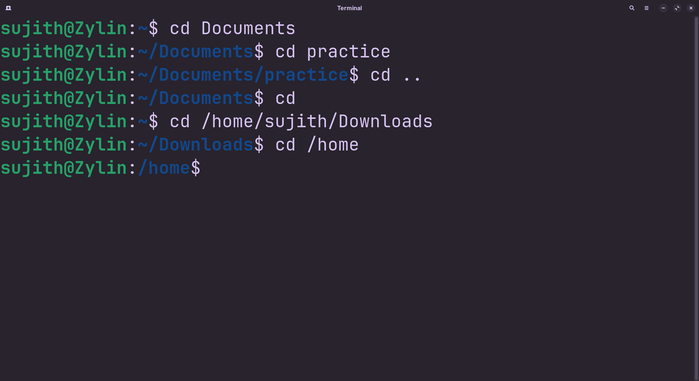

<!-- meta: day=3 cmd="cd" category="File Navigation" file="3. cd.md" date="2026-08-12" -->
  

  

# `cd`

> Move between folders in the terminal

---

## Description

cd (Change Directory) updates your active location in the system's folder hierarchy. When using a command-line interface, there is no graphical window to click through; cd acts as your primary navigation tool, moving your working context to any path you specify.

## Syntax

```bash
cd [DIRECTORY]
```

## Options

| Flag | Long Flag | Description |
|------|-----------|-------------|
| — | — | No options documented |

## Arguments

| Argument | Description |
|----------|-------------|
| `DIRECTORY` | The folder you want to move into. Leave blank to go to your home folder. Use '..' to go up one level. |

## Execution & Output

```text
sujith@Zylin:~$ cd Assets
sujith@Zylin:~/Assets$ cd ..
sujith@Zylin:~$ 
```


