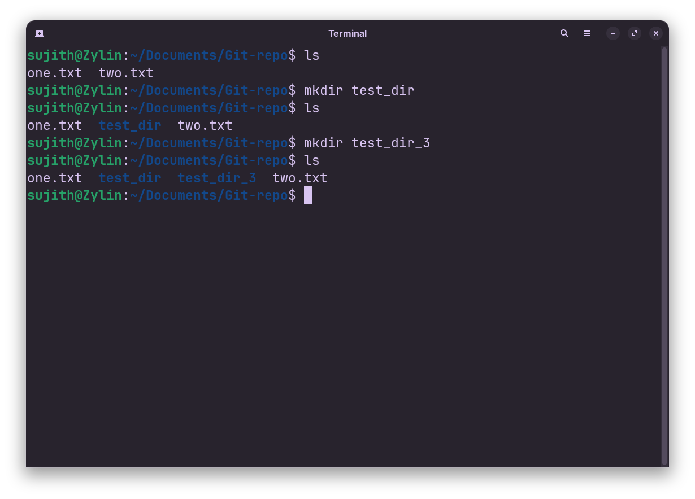

<!-- meta: day=4 cmd="mkdir" category="File Operations" file="4. mkdir.md" date="2026-08-13" -->
  

# `mkdir`

> Create a new folder instantly

---

## Description

mkdir (Make Directory) allocates a new, empty folder at a specified destination. It serves as the command-line equivalent of creating a new folder from a context menu, giving you precise control over folder structures directly from your terminal.

## Syntax

```bash
mkdir [OPTIONS] FOLDER_NAME
```

## Options

| Flag | Long Flag | Description |
|------|-----------|-------------|
| `-p` | `--parents` | Create any missing parent folders along the way, instead of erroring out. |
| `-v` | `--verbose` | Print a message for every folder that gets created. |

## Arguments

| Argument | Description |
|----------|-------------|
| `FOLDER_NAME` | The name (or path) of the folder you want to create. |

## Execution & Output

```text
sujith@Zylin:~$ mkdir Projects
sujith@Zylin:~$ mkdir -p Projects/2026/August
sujith@Zylin:~$ ls
Assets  Projects  README.md  cheatsh
```


