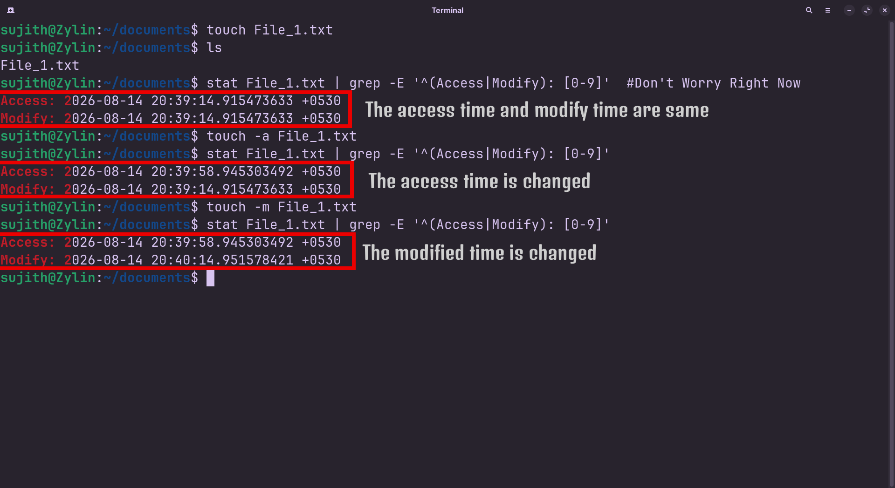

<!-- meta: day=5 cmd="touch" category="File Operation" file="5. touch.md" date="2026-08-14" -->
  

# `touch`

> Create an empty file (or update its timestamp).

---

## Description

touch generates a brand-new, empty file if the specified filename does not exist. If the targeted file is already present, touch updates its last-accessed and last-modified timestamps without altering or deleting any existing text inside.

## Syntax

```bash
touch [OPTIONS] FILE_NAME
```

## Options

| Flag | Long Flag | Description |
|------|-----------|-------------|
| `-a` | `—` | Description: Update only the access time of the file. |
| `-m` | `—` | Description: Update only the modification time of the file. |

## Arguments

| Argument | Description |
|----------|-------------|
| `FILE_NAME` | The name of the file you want to create or 'refresh' |

## Execution & Output

```text
sujith@Zylin:~$ touch notes.txt
sujith@Zylin:~$ ls -l notes.txt
-rw-r--r-- 1 sujith sujith 0 Aug 12 09:15 notes.txt
```


