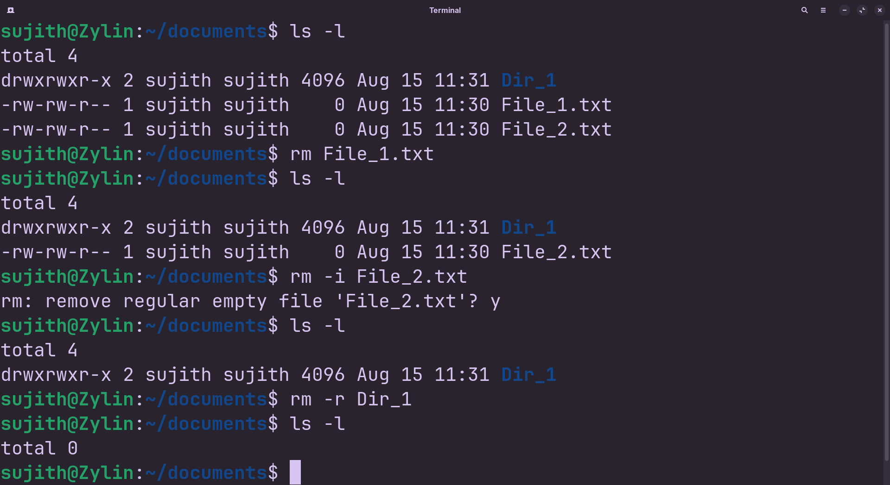

<!-- meta: day=6 cmd="rm" category="File Operation" file="6. rm.md" date="2026-08-15" -->
  

# `rm`

> Delete files or folders.

---

## Description

rm (Remove) permanently deletes files and directory structures from your storage drive. Because terminal file deletions bypass standard graphical recycling bins, items removed with rm cannot be easily restored and must be handled with care.

## Syntax

```bash
rm [OPTIONS] FILE_OR_FOLDER
```

## Options

| Flag | Long Flag | Description |
|------|-----------|-------------|
| `-r` | `--recursive` | Delete a folder and everything inside it. |
| `-f` | `--force` | Delete without asking for confirmation, even if the file doesn't exist. |
| `-i` | `--interactive` | Ask for confirmation before deleting each file. |

## Arguments

| Argument | Description |
|----------|-------------|
| `FILE_OR_FOLDER` | The file or folder you want to permanently delete. |

## Execution & Output

```text
sujith@Zylin:~$ rm notes.txt
sujith@Zylin:~$ ls
Assets  Projects  README.md  cheatsheet
```


