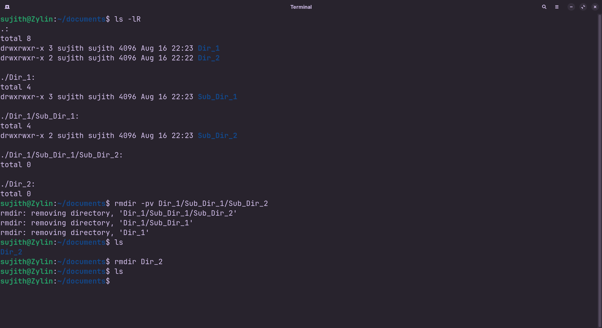

<!-- meta: day=7 cmd="rmdir" category="File Operations" file="7. rmdir.md" date="2026-08-16" -->
  

# `rmdir`

> Delete an empty Folder

---

## Description

rmdir (Remove Directory) safely deletes folders, but only if they are completely empty. If a target folder contains nested files or subdirectories, rmdir safely halts operation, preventing accidental loss of contained data.

## Syntax

```bash
rmdir [OPTIONS] FOLDER_NAME
```

## Options

| Flag | Long Flag | Description |
|------|-----------|-------------|
| `-p` | `--parents` | Remove the folder and any now-empty parent folders above it. |
| `-v` | `--verbose` | Print a message for every folder that gets removed. |

## Arguments

| Argument | Description |
|----------|-------------|
| `FOLDER_NAME` | The empty folder you want to delete. |

## Execution & Output

```text
sujith@Zylin:~$ rmdir OldFolder
sujith@Zylin:~$ ls
Assets  Projects  README.md  cheatsheet
```


