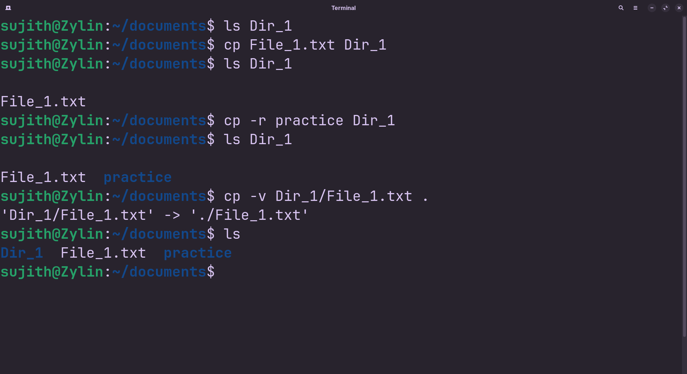

<!-- meta: day=8 cmd="cp" category="File Operations" file="8. cp.md" date="2026-08-17" -->
  

# `cp`

> Copy files or folders.

---

## Description

cp (Copy) creates an exact duplicate of a target file or folder structure and places it at a destination path. The original source item remains completely unchanged, making cp ideal for creating backups before editing critical configurations.

## Syntax

```bash
cp [OPTIONS] SOURCE DESTINATION
```

## Options

| Flag | Long Flag | Description |
|------|-----------|-------------|
| `-r` | `--recursive` | Copy a folder and everything inside it. |
| `-v` | `--verbose` | Print what is being copied as it happens. |
| `-i` | `--interactive` | Ask before overwriting an existing file. |

## Arguments

| Argument | Description |
|----------|-------------|
| `SOURCE` | The file or folder you want to copy. |
| `DESTINATION` | Where the copy should be placed, and what it should be named. |

## Execution & Output

```text
sujith@Zylin:~$ cp README.md README_backup.md
sujith@Zylin:~$ ls
Assets  README.md  README_backup.md  cheatsheet
```


