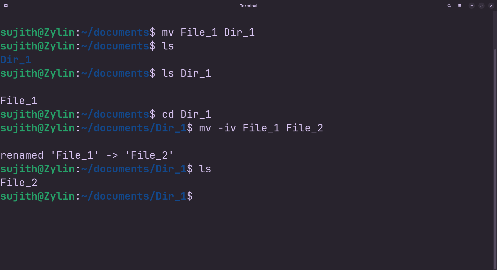

<!-- meta: day=9 cmd="mv" category="File Operations" file="9. mv.md" date="2026-08-18" -->
  

# `mv`

> Move or rename a file or folder.

---

## Description

mv (Move) shifts files or directories from one location to another. If the source and destination paths reside within the same directory, mv simply updates the name entry on disk, effectively serving as the command-line rename tool.

## Syntax

```bash
mv [OPTIONS] SOURCE DESTINATION
```

## Options

| Flag | Long Flag | Description |
|------|-----------|-------------|
| `-i` | `--interactive` | Ask before overwriting an existing file. |
| `-v` | `--verbose` | Print what is being moved as it happens. |

## Arguments

| Argument | Description |
|----------|-------------|
| `SOURCE` | The file or folder you want to move or rename. |
| `DESTINATION` | The new location and/or new name for it. |

## Execution & Output

```text
sujith@Zylin:~$ mv README_backup.md Assets/README_backup.md
sujith@Zylin:~$ ls Assets
README_backup.md  Screenshots
```


