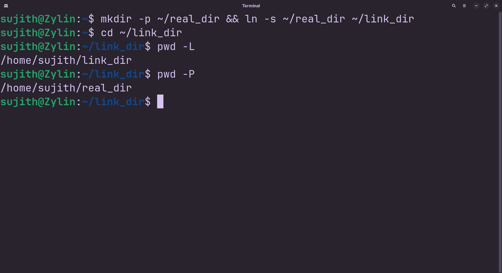

  

# pwd

> Know exactly where you stand in the filesystem.

---

## Description

pwd stands for "print working directory." It prints the absolute path of the folder you're currently sitting in — no guessing, no scrolling up to check an old command. It's the first thing worth knowing because almost every other command (cp, mv, ls) works relative to wherever pwd says you are.

## Syntax

```bash
pwd [OPTIONS]
```

## Options

| Flag | Long Flag | Description |
|------|-----------|-------------|
| -L | --logical | Print the logical path, following the $PWD environment variable as-is (default behavior) |
| -P | --physical | Print the actual physical path on disk, resolving all symbolic links. |

## Arguments

| Argument | Description |
|----------|-------------|
| — | No arguments |

## Execution & Output

```text
/home/sujith/linux-commands-cheatsheet
```


